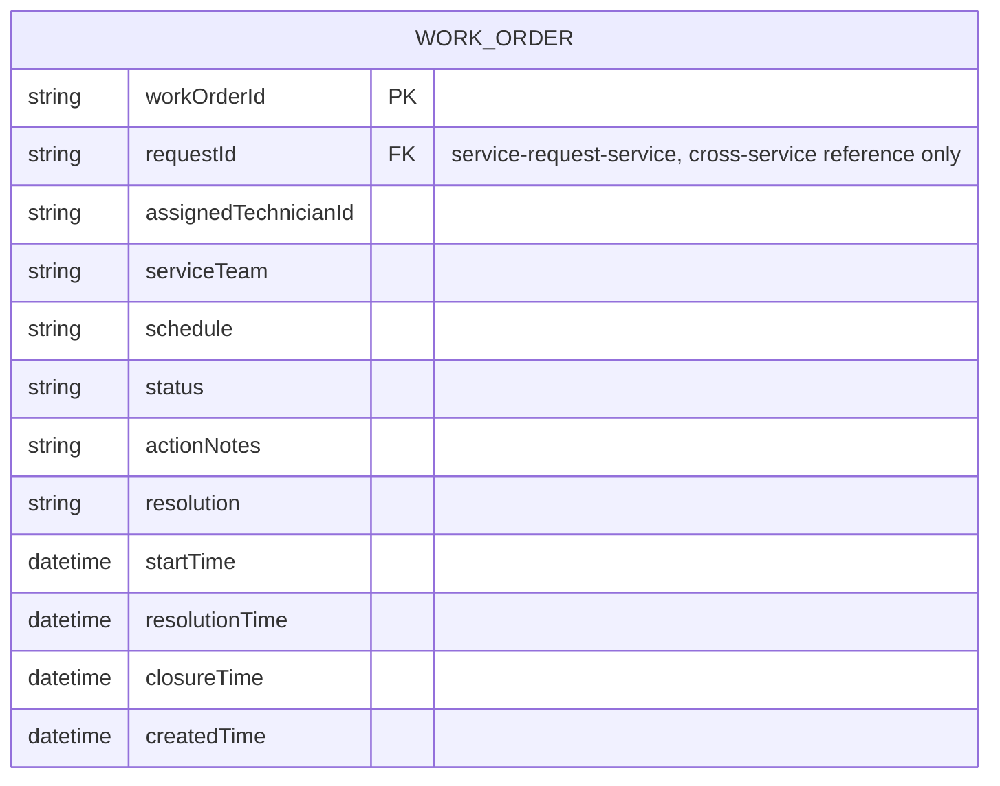
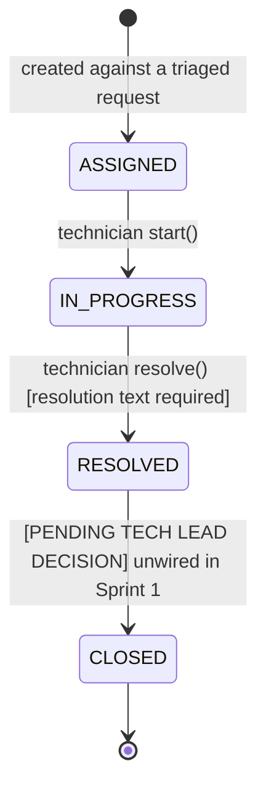

# work-order-service — Data Model & Lifecycle

## Entity-Relationship Diagram

`requestId` is a reference to `service-request-service`'s own `ServiceRequest.requestId` — resolved and validated only through `ServiceRequestClient` (a REST call), never a foreign key into another service's database.

## Status lifecycle (`WorkOrderStatus`)

The domain enum `com.usm.workorder.domain.WorkOrderStatus` defines 4 statuses:
- `ASSIGNED`
- `IN_PROGRESS`
- `RESOLVED`
- `CLOSED`

### Active transitions in Sprint 1
1. `[*] -> ASSIGNED`: Created by `SERVICE_DESK_OFFICER` (`POST /api/work-orders`) against a triaged request (`ACKNOWLEDGED` or `ESCALATED`). Pushes `status=ASSIGNED` back to `service-request-service`.
2. `ASSIGNED -> IN_PROGRESS`: Triggered by the assigned technician (`PATCH /api/work-orders/{id}/start`). Sets `startTime` and pushes `status=IN_PROGRESS` back to `service-request-service`.
3. `IN_PROGRESS -> IN_PROGRESS`: Technician appends action notes (`PATCH /api/work-orders/{id}/progress`) (BR-07).
4. `IN_PROGRESS -> RESOLVED`: Triggered by the assigned technician with non-blank resolution (`PATCH /api/work-orders/{id}/resolution`) (BR-08). Sets `resolutionTime` and pushes `status=RESOLVED` back to `service-request-service`.

### Status of `WorkOrderStatus.CLOSED`
- **Known limitation / Architecture Decision:** `WorkOrderStatus.CLOSED` and the `closure_time` column exist in the domain model and MySQL schema (`V1__create_work_order_table.sql`) per the project specification. However, **no endpoint in Sprint 1 drives the `RESOLVED -> CLOSED` transition**.
- Wiring for `CLOSED` is deferred pending explicit decision and contract agreement from the team Tech Lead (e.g., whether closure is driven via an internal callback from `service-request-service` when the requester confirms completion, or via an explicit admin/technician endpoint).

## Cross-service integration

Every status transition calls back into `service-request-service` (`ServiceRequestClient`) to keep the parent request's status in sync: `ASSIGNED` on creation, `IN_PROGRESS` on start, `RESOLVED` on resolution. No direct database access between services — this is the only integration path.

## Business rules enforced

- **BR-06**: creation is refused unless the parent request is triaged (`ACKNOWLEDGED`/`ESCALATED`), and refuses a second active work order for the same request.
- **BR-07**: progress updates (`/progress`) require the order to be in `IN_PROGRESS` status (cannot be called before `/start`).
- **BR-08**: `resolve` requires non-blank resolution text and requires an active work order (`ASSIGNED` or `IN_PROGRESS`).
- **BR-09**: status transitions and their respective timestamps (`startTime`, `resolutionTime`) are recorded together atomically.
- **Ownership**: only the assigned technician can `start`, `addProgress`, or `resolve` their own work order; non-privileged users cannot view work orders assigned to others.
- **Service-to-service protection**: `/api/work-orders/by-request/{requestId}` is restricted exclusively to callers presenting a `SERVICE` role token.
